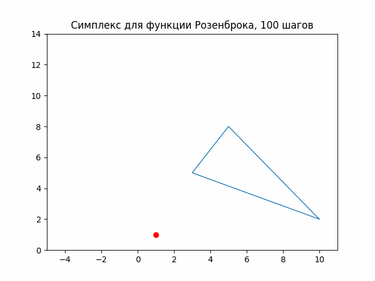

# Метод Нелдера-Мида
## Описание
Метод Нелдера-Мида (метод деформирующего многогранника, симплекс метод) - метод безусловной оптимизации функции от нескольких переменных. Главным преимуществом является то, что метод не использует градиентов функции и потому применим к негладким функциям. Данный метод является итерационным. Суть метода заключается в деформировании симплекса и поступательном приближении к минимуму функции. Потому, результат метода зависит от выбора начального симплекса. Стоит также учитывать, что метод может "застрять" в одном из локальных минимумом, что решается выбором другого симплекса. 
## Реализация метода
### Параметры
- `alpha` - коэффициент отражения, обычно равен 1
- `betta` - коэффициент сжатия, обычно равен 0.5
- `gamma` - коэффициент растяжения, обычно равен 2
### Алгоритм метода
Метод Нелдера-Мида может быть реализован разными способами. В данной реализации был выбран алгоритм, описанный [здесь](https://ru.wikipedia.org/wiki/Метод_Нелдера_—_Мида). Операции отражения, сжатия и растяжения (включая последующие проверки) были вынесены в отдельные функции. В качестве условия останова было выбрано ограничение по итерациям (циклам) алгоритма, а также "ранние" условия останова:
- по взаимной близости точек (когда дисперсия меньше заданного значения `eps0`)
- по количеству "бесполезных" итераций подряд (когда абсолютная разница между найденным значением функции и предыдущим меньше заданного `eps1`)

В качестве начального симплекса можно передать одну или несколько точек. Можно не задавать симплекс, тогда он будет сгенерирован случайно вблизи нулевой точки
### Использование метода
1. Создание экземпляра класса с необходимыми параметрами метода.
```python
method = NelderMead()
```
Или 
```python
method = NelderMead(alpha=1.5, max_steps=2000, eps0=10**(-6))
```
2. Инициализация оптимизируемой функции и задание начального симплекса (опционально)
```python
function = Rosenbroke()
method.fit(function, Point(10, 3), Point(2, 4), Point(3,5))
```
Или
```python
function = Rosenbroke()
method.fit(function, Point(2, 4))
```
Или 
```python
function = Himmelblau()
method.fit(function)
```
3. Запуск метода. Опционально можно передать функцию, которая будет срабатывать в конце каждой итерации
```python
result = method.Run()
```
Или 
```python
result = method.Run(action=lambda x: print(x))
```
Или
```python
def foo(m):
  print(m.simplex)

result = method.Run(action=foo)
```
# Модифицированный метод Нелдера-Мида
## Описание
Классический метод Нелдера-Мида является методом безусловной оптимизации, однако не менее часто встречаются задачи условной оптимизации. В чистом виде метод Нелдера-Мида неприменим для их решения, однако он может служить основой для других методов. 

В качестве алгоритма решения задач условной оптимизации была взята одна из вариаций метода штрафных функций: [метод барьерных функций](http://www.machinelearning.ru/wiki/index.php?title=Метод_штрафных_функций). Он позволяет свести задачу условной оптимизации к задаче безусловной оптимизации, после чего решить её, допустим, методом Нелдера-Мида. Преимуществом является то, что на каждой последующей итерации используется решение, полученное на предыдущей итерации, а также увеличивается штраф за нарушение ограничений. Однако, слишком большое увеличение штрафа может привести к большей погрешности.
## Реализация
### Выбранные функции
Метод барьерных функций реализован в классе `ConditionalNelderMead`. В общей постановке задачи оптимизации предполагается наличие:
- Ограничений-равенств вида $f(x)=0$ и\или
- Ограничений-неравенств вида $f(x)<=0$

В качестве штрафных функций взяты: 
- $|f(x)|$ для ограничений-равенств
- $max(0, f(x))$ для ограничений-неравенств

Метод, однако, может работать с любыми другими штрафными функциями, которые могут быть определены через создание собственных реализаций класса `Constraint`.
### Параметры метода
- `start_weight` - начальное значение коэффициента штрафов
- `betta` - коэффициент увеличения коэффицента штрафов
- `eps` - предельное значение штрафа (условие останова)
- `max_steps` - максимальное количество шагов (условие останова)
### Использование метода
Рассмотрим решение простой задачи:
$$(x_1 - 1)^2 + x_2^2 \to min$$
$$x_1 + x_2 - 0.5 \leq 0$$
1. Создание метода Нелдера-Мида, целевой функции и ограничений
```python
nm_method = NelderMead()
func = Polynomial([[1, -2, 1], [0, 0, 1]]) 
constr_func = Polynomial([[-0.5, 1], [0, 1]])
constraint = Inequality(constr_func)
```
2. Выбор начальной точки и создание экземпляра алгоритма
```python
start_point = Point(0, 0)
method = ConditionalNelderMead()
method.fit(nm_method, func, constraint)
```
3. Запуск алгоритма
```python
result = method.run(start_point)
```
В результате получим решение $X^{\ast}=(0.7529661278240383, -0.2529709404334426)$ , $Q(X^{\ast})=0.125020030706030$

Нетрудно найти решение задачи аналитически: $X^{\ast}=(0.75, -0.25)$, $Q(X^{\ast})=0.125$
# Структура проекта
## `gifs`
Папка с gif-файлами иллюстрации работы метода
## `tests` 
Папка с pytest-тестами, которые тестируют классы из папки `scripts`
## `scripts`
Папка с основными модулями:
- `functions.py` - модуль с классами функций, передаваемых в метод Нелдера-Мида:
  - `BaseFunction` - базовый класс, хранящий произвольное символьное выражение и набор символов-переменных. Предоставляет стандартный интерфейс для других классов
  - `Polynomial` - класс для более удобного формирования многомерных полиномов
  - `Rosenbroke` - класс с функцией Розенброка (двумерной)
  - `Himmelblau` - класс с функцией Химмельблау
- `point.py` - модуль с классом `Point`, реализующим многомерную точку (вектор) и операции с ней
- `nelder_mead.py` - модуль с методом Нелдера-Мида:
  - `NelderMead` - класс, непосредственно реализующий метод
  - `Simplex` - иммутабельный класс, хранящий симплекс и предоставляющий интерфейс работы с ним
- `conditional_nm.py` - модуль с классом `ConditionalNelderMead` для решения задач условной оптимизации с помощью метода Нелдера-Мида
- `constraints.py` - модуль с классами-ограниченями:
  - `Constraint` - базовый абстрактный класс
  - `Equality` - класс для ограничений-равенств
  - `Inequality` - класс для ограничений-неравенств
- `nm_visualization.py` - модуль для визуализации работы метода:
  - `PlotSettings` - класс, управляющий графиков
  - `NelderMead2DAnimation` - класс для анимации работы метода
## `main.py`
Модуль с демонстрацией работы с основными модулями. В приведённом примере создаётся анимация изменения симплекса функции Розенброка с каждой итерацией. Красной точкой на графике отображается точка минимума.

<picture>
  <source media="(prefers-color-scheme: dark)" srcset="gifs/animation_100_dark.gif">
  <source media="(prefers-color-scheme: light)" srcset="gifs/animation_100.gif">
  
</picture>
