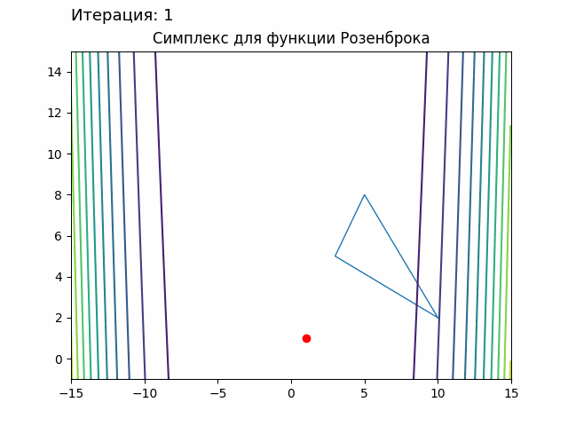

.. _addons:

Addons
======
Дополнительный функционал для модуля :ref:`nelder_mead <nm>`.
Использует также модуль :ref:`utilities <utilities>`.

addons.nm\_visualization
-------------------------------

.. automodule:: addons.nm_visualization
   :members:
   :undoc-members:
   :show-inheritance:
   :special-members: __init__

addons.params\_search
----------------------------

.. automodule:: addons.params_search
   :members:
   :undoc-members:
   :show-inheritance:
   :special-members: __init__

Примеры:
--------
Визуализация:
~~~~~~~~~~~~~
Нахождение минимума функции Розенброка:

.. code-block:: python
    :linenos:

    from utilities.functions import Rosenbroke
    from utilities.point import Point
    from nelder_mead import NelderMead
    from addons import PlotSettings, NelderMead2DAnimation

    title = "Симплекс для функции Розенброка"
    plot = PlotSettings(title, (-15, 15), (-1, 15))
    plot.contour_init(Rosenbroke())
    plot.plot_point(Point(1, 1), fmt="ro")
    plot.text.set_position((-15, 16.5))
    plot.text.set_size(13)

    method = NelderMead(max_steps=100, max_blank=10, eps1=0.001)
    method.fit(Rosenbroke(), Point(10, 2), Point(3, 5), Point(5, 8))
    anim = NelderMead2DAnimation(method, plot)

    def text_setter(index: int):
        plot.text.set_text(f"Итерация: {index + 1}")

    anim.animate(action=text_setter)
    anim.save("gifs/animation_100.gif")
    plot.show()

Результат:

    Нахождение минимума функции Розенброка

Поиск параметров:
~~~~~~~~~~~~~~~~~
Поиск параметров для функции Розенброка:

.. code-block:: python
    :linenos:

    import numpy as np
    from utilities.functions import Rosenbroke
    from utilities.point import Point
    from addons.params_serach import SearchNelderMeadParams

    searcher = SearchNelderMeadParams(
        {
            "alpha": np.linspace(0.5, 1.5, 3),
            "betta": np.linspace(0, 1, 3),
            "gamma": np.linspace(1.5, 2.5, 3)
        },
        Rosenbroke(), [Point.zero(2)]
    )
    res = searcher.run(max_optimal_count=5)
    print("TOP-5:")
    number = 1
    for value, params in res:
        print(f"\t#{number}:")
        print(f"\tValue: {value}")
        print(f"\tParams: {params}")
        number += 1

Результат::

    TOP-5:
        #1:
        Value: 0
        Params: {'alpha': 1.0, 'betta': 0.0, 'gamma': 1.5}
        #2:
        Value: 0
        Params: {'alpha': 1.0, 'betta': 0.0, 'gamma': 2.0}
        #3:
        Value: 0
        Params: {'alpha': 1.0, 'betta': 0.0, 'gamma': 2.5}
        #4:
        Value: 0
        Params: {'alpha': 1.5, 'betta': 0.0, 'gamma': 2.0}
        #5:
        Value: 0.0000599792801518458
        Params: {'alpha': 1.0, 'betta': 0.5, 'gamma': 2.0}

--------

Поиск параметров для задачи:

.. math::

   (x_1-1)^2+(x_2)^2 \to min

   x_1+x_2-0.5 \leq 0

.. code-block:: python
    :linenos:

    import numpy as np
    from utilities.functions import Polynomial
    from utilities.constraints import Inequality
    from utilities.point import Point
    from addons.params_search import SearchConditional

    function = Polynomial([[1, -2, 1], [0, 0, 1]])
    constr_func = Polynomial([[-0.5, 1], [0, 1]])
    constraints = (Inequality(constr_func), )
    start_point = Point(0, 0)

    searcher = SearchConditional(
        {
            "betta": np.linspace(1.5, 2.5, 3),
            "start_weight": np.linspace(1, 3, 3)
        },
        {
            "alpha": np.linspace(0.5, 1.5, 3),
            "betta": np.linspace(0, 1, 3),
            "gamma": np.linspace(1.5, 2.5, 3)
        },
        function, constraints, start_point
    )
    res = searcher.run(max_optimal_count=5)
    print("TOP-5:")
    number = 1
    for value, params_dict in res:
        print(f"\t#{number}:")
        print(f"\tValue: {value}")
        print(f"\tNM Params: {params_dict['nm_params']}")
        print(f"\tCNM Params: {params_dict['cnm_params']}")
        number += 1

Результат::

    TOP-5:
        #1:
        Value: 0.124968299107421
        NM Params: {'alpha': 1.5, 'betta': 0.5, 'gamma': 1.5}
        CNM Params: {'betta': 1.5, 'start_weight': 1.0}
        #2:
        Value: 0.124968299107421
        NM Params: {'alpha': 1.5, 'betta': 0.5, 'gamma': 2.0}
        CNM Params: {'betta': 1.5, 'start_weight': 1.0}
        #3:
        Value: 0.124968299107421
        NM Params: {'alpha': 1.5, 'betta': 0.5, 'gamma': 2.5}
        CNM Params: {'betta': 1.5, 'start_weight': 1.0}
        #4:
        Value: 0.125020030706030
        NM Params: {'alpha': 1.0, 'betta': 0.5, 'gamma': 1.5}
        CNM Params: {'betta': 1.5, 'start_weight': 1.0}
        #5:
        Value: 0.125020030706030
        NM Params: {'alpha': 1.0, 'betta': 0.5, 'gamma': 2.0}
        CNM Params: {'betta': 1.5, 'start_weight': 1.0}
